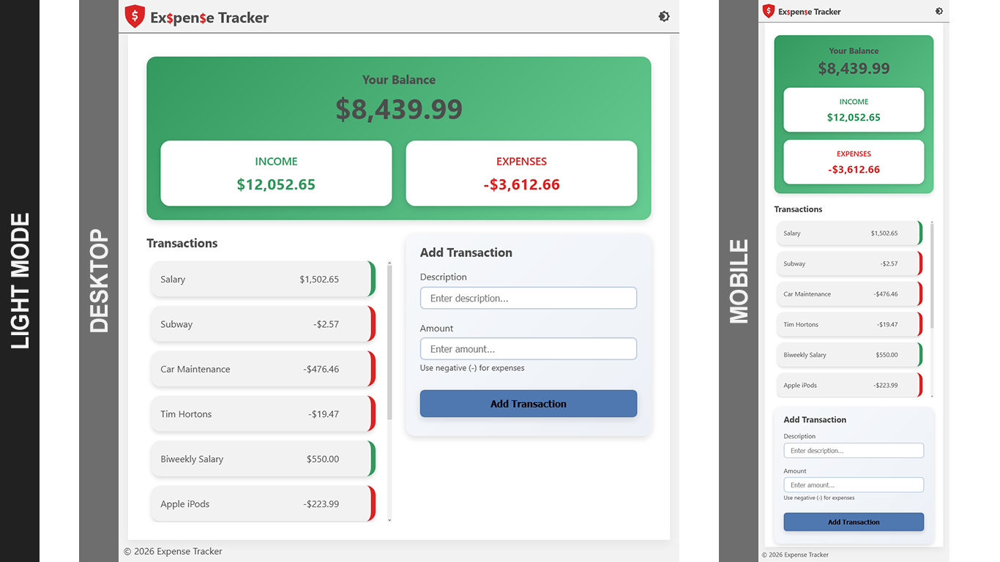
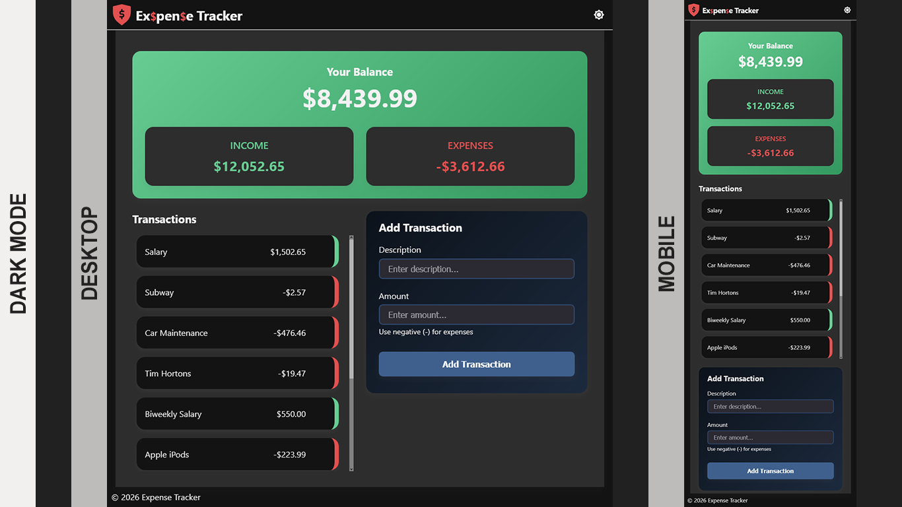

# Expense Tracker - FCC

This is a simple Expense Tracker project using HTML, CSS, and JS.

# Table of contents

- [Expense Tracker - FCC](#expense-tracker---fcc)
    - [Table of contents](#table-of-contents)
    - [Screenshots](#screenshots)
    - [My process](#my-process)
        - [Built with](#built-with)
    - [Author](#author)

## Screenshots

Light mode screenshots of desktop & mobile

Dark mode screenshots of desktop & mobile

## My process

Like most projects, always start with the small wins. Create the basic HTML file. Style to a point where it looks okay, as one can make other tweaks along the way. For the script, started with:

1. Adding a transaction to local storage
1. Updating the transaction list with the newly recorded transaction
1. Actually, displaying the updated transaction list
1. Updating the summary values (ie. balance, income & expenses)
1. Removing transactions

### Built with

- Semantic HTML5 markup
- CSS custom properties
- CSS Grid & Flex
- Javascript

## Author

- [@davejnicol](https://github.com/davejnicol)
